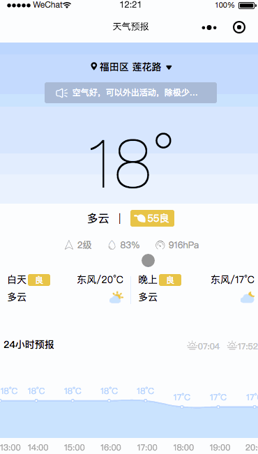
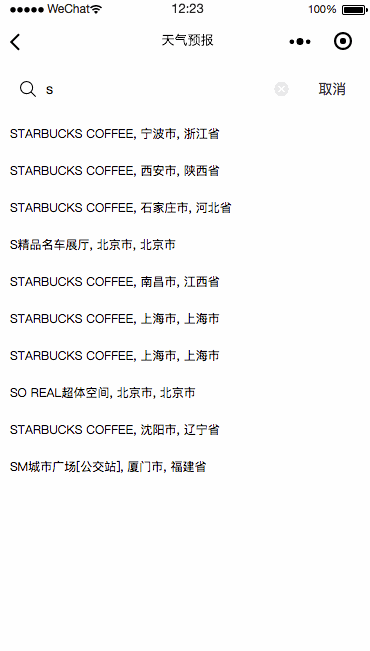

# 🔥 weather
微信小程序开发的天气预报

> 启动项目时，还需要启动另一个项目[middleware](https://github.com/wuzaofeng/middleware)充当中间件请求weather接口
> 在开发的过程中，可能会没发现到一些特别的问题，有什么建议和问题，欢迎大牛们在[Issues](https://github.com/wuzaofeng/weather/issues)提出更加好的方案。
> [微信小程序文档](https://developers.weixin.qq.com/miniprogram/dev/)

## 功能
- [x]  地址定位
- [x]  当前定位天气情况
- [x]  24小时天气情况
- [x]  7天天气情况
- [x]  当前地址相关指数
- [x]  搜索地址
- [x]  历史记录

## 目录结构
```
- ec-canvas                 canvas插件
- iconfont                  字体图片
- images                    可以将图片放在服务器请求（减少文件体积）
    index                       指数图片
    weather                     天气描述图片
- libs                      
    city-code.js                城市代码文件
    makePy.js                      文字转拼音首字母
    qqmap-wx-jssdk.min.js       腾讯地图
    weather.js                  天气描述
- pages
    weather                     天气首页
    search                      搜索地址页
- server
    type.js                     请求地址
- utils                         工具文件

## 视图展示
##### 首页



##### 搜索✌️


##### 关键字搜索✌️
